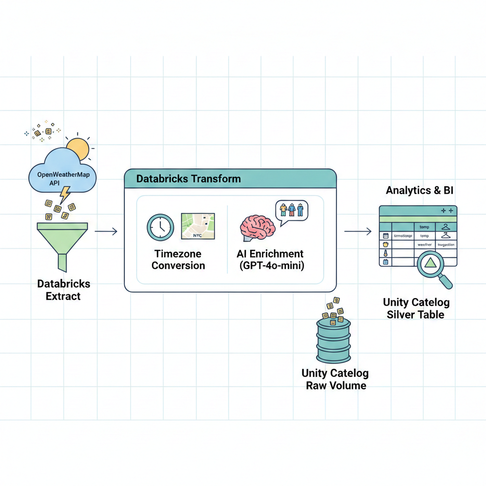
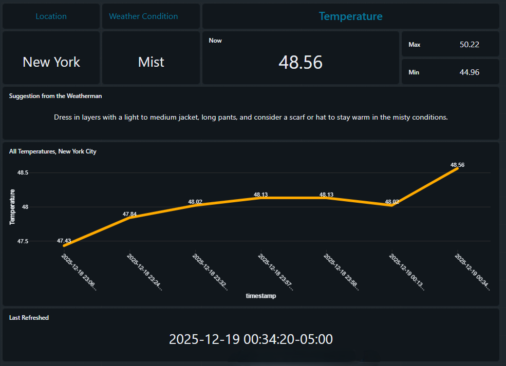

# Weather Data ETL & AI Integration Pipeline
This project demonstrates a complete Extract, Transform, Load (ETL) workflow within Databricks. 
It integrates the [OpenWeatherMap API](https://openweathermap.org/) for data retrieval and the OpenAI GPT-4o-mini model to provide personalized, weather-based dressing suggestions.

## Project Overview

The notebook implements a full ETL (Extract, Transform, Load) cycle:
* **Extract**: Fetches current weather data for New York City via the OpenWeatherMap API.
* **Transform**: Converts UTC timestamps to New York local time and utilizes OpenAI's GPT-4o-mini to generate personalized dressing suggestions based on the temperature.
* **Load**: Persists the data into the Databricks Unity Catalog as both raw JSON files and a structured Delta table.
* **Orchestration**: The notebook with this ETL code is added to a job and scheduled to run every 1 hour in Databricks.
* **Analytics**: The silver layer feeds a Databricks Dashboard that displays relevant weather information alongside the LLM's suggestions.

## Technical Stack

* Platform: Databricks.
* Language: Python (PySpark) and SQL.
* APIs: OpenWeatherMap and OpenAI.
* Storage: Delta Lake and Unity Catalog Volumes.

## Technical Features

1. Modular Extraction
The code utilizes a Weather Python class to encapsulate API logic. This makes the code *reusable and maintainable*.
* Source: [OpenWeatherMap API](https://openweathermap.org/)
* Parameters: City, Country, and Units (Imperial/Metric).

2. AI Enrichment
* The pipeline integrates with the OpenAI API to add a "Suggestion" column.
* Model: gpt-4o-mini
* Logic: The model acts as a "weatherman," taking temperature and conditions as input to produce a concise dressing recommendation (e.g., "Dress in layers with a warm sweater or light jacket...").

3. Data Transformation
* Timezone Conversion: Uses zoneinfo and datetime to convert UTC timestamps to America/New_York time.
* Spark Integration: Converts raw Python dictionaries into a high-performance PySpark DataFrame.

4. Storage & Lakehouse Layers
* The project utilizes Databricks Unity Catalog for organized storage:
* Catalog: pipeline_weather
* Raw Volume: Stores raw JSON responses with high-resolution timestamps for auditability.
* Silver Table: A Delta table (pipeline_weather.silver.weather) that stores the cleaned, schema-enforced, and AI-enriched data.

## Setup & Requirements

### Dependencies

The notebook requires the following libraries:
* `openai`: For LLM integration.
* `requests`: For API calls.
* `pyspark`: For data processing.

## Configuration

The following Databricks Secrets/Widgets must be configured:

* API_KEY: Your OpenWeatherMap API key.
* OPENAI_API_KEY: Your OpenAI API key.

## How to Use

1. Import the Notebook: Upload the .ipynb file to your Databricks workspace.
2. Configure Widgets: Ensure the API keys are provided in the notebook widgets.
3. Run the Pipeline: (Automatically scheduled via *Jobs & Pipelines* in Databricks every 1 hour)
* The first cells install dependencies and initialize the Weather class.
* The Extract section fetches data for New York City.
* The Transform section processes the data and calls OpenAI.
* The Load section creates the necessary SQL objects and saves the data.

## Data Sample
The final output is a structured table containing:

| id | timestamp | weather | temp | tmin | tmax | city | suggestion | 
| :--- | :--- | :--- | :--- | :--- | :--- | :--- | :--- | 
| 5128581 | 2025-12-19 ... | Clouds | 48.02 | 43.57 | 49.95 | New York | Dress in layers... |

## Dashboard

